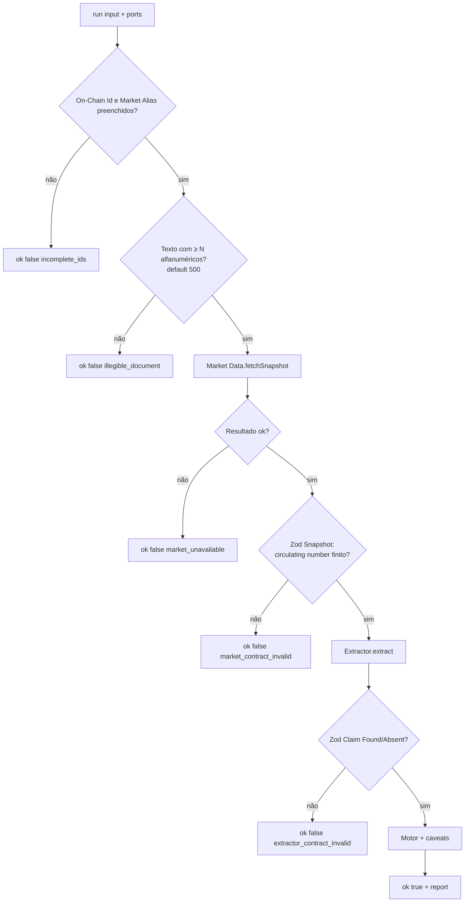
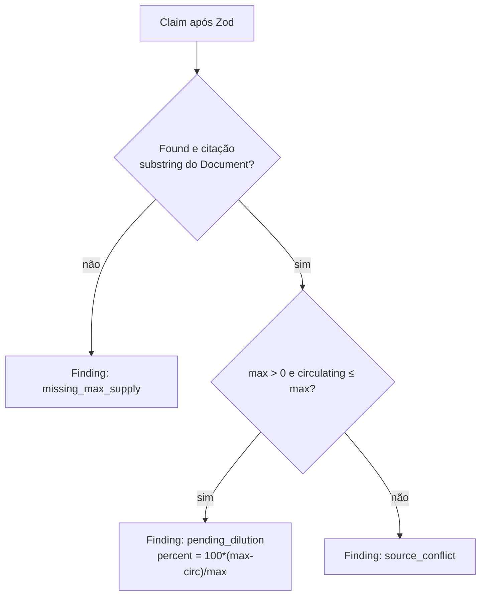

# TokenLens

Inteligência **verificável** para tokenomics: lê um whitepaper como evidência hostil, confere se a citação existe no texto, cruza com a oferta circulante do mercado e devolve um **Audit Report** — sem score, sem “token saudável”, sem resumo de marketing.

O LLM **não calcula**. Ele só propõe um fato (`maxSupplyAmount`) com citação literal. A matemática e a prova de trabalho rodam em TypeScript determinístico.

Repositório: [github.com/ilaraca/token-lens](https://github.com/ilaraca/token-lens)

---

## O problema

Whitepapers misturam parâmetro mecânico com adjetivo. APIs de mercado devolvem circulante sem dizer se o documento prometeu um teto. Quem analisa acaba inferindo números (“one billion”) ou aceitando um rating A–F que não dá para auditar.

TokenLens v1 responde a uma pergunta estreita e checável:

> Neste instante, para **este** token, **este** texto e **este** snapshot de mercado: o documento declara um teto numérico com citação literal? Se sim, quantos % ainda não estão em circulação? Se as fontes se contradizem, o conflito fica explícito?

---

## Aplicabilidade

### Onde faz sentido

| Situação | Por quê |
|----------|---------|
| Due diligence de um token **antes** de alocar | Separa fato citado de narrativa |
| Revisar um whitepaper / docs oficiais colados como texto | Proof of Work: a citação tem de estar no Document |
| Cruzar teto declarado com `circulating` (CoinGecko ou dublê) | Diluição pendente é conta, não opinião do modelo |
| CI / agente que não pode depender de “o LLM achou que…” | Zod + substring + motor; o modelo é substituível |
| Ensinar ou demonstrar extração forense vs cálculo | Seam única: `run` |

### Onde **não** usar (ainda)

| Situação | Motivo |
|----------|--------|
| Saber se o contrato é proxy / upgradeable / multisig | Fora do v1 (sem leitura on-chain) |
| Vesting, unlocks, % de equipe, governança DAO no texto | Não são Claims deste corte |
| Score, rating, “saudável se diluição &lt; 20%” | Recusado de propósito (ADR 0001) |
| Monitoramento contínuo / alertas 24h | Um Audit Pair é um instante, não um feed |
| PDF escaneado sem OCR decente | Texto abaixo de 500 alfanuméricos aborta (sem teatro) |
| Inferir “1 billion” só por extenso | Silêncio: sem dígitos no Document o fato está ausente |
| Relatório só do whitepaper quando a API cai | Sem as três pernas **não há** Audit Pair (ADR 0003) |

### Público

- Analistas e researchers que precisam de rastro (citação + hash do texto)
- Devs que vão plugar `run` num BFF, CLI ou job
- Tech leads que querem o LLM **atrás** de um contrato, não no lugar do motor

---

## Conceitos (vocabulário)

Use estes nomes; o glossário canônico está em [`CONTEXT.md`](./CONTEXT.md).

| Termo | O que é |
|-------|---------|
| **Audit Pair** | Token + Document legível + Market Snapshot no mesmo instante |
| **Token** | `chainId` + `contractAddress` **e** Market Alias (você informa os dois) |
| **Document** | Texto persistido; hash SHA-256 no Audit Record |
| **Extractor** | LLM (ou dublê): só Claims + Evidence |
| **Auditor** | Pipeline `run` — produto, não o modelo |
| **Evidence / Claim** | Um fato (`maxSupplyAmount`) com `found`, valor, citação, caveats |
| **Finding** | Saída do motor: teto ausente, diluição %, conflito de fontes |
| **Audit Report** | Claims + Findings. Sem score e sem `narrativeSummary` |

---

## Arquitetura

```
Você
  │  On-Chain Id + Market Alias + texto do Document
  ▼
┌─────────────────────────────────────────────────────────┐
│  Auditor.run                                            │
│                                                         │
│  1. Guards (ids, legibilidade)                          │
│  2. Market Data port ──► Snapshot (circulating, price?) │
│  3. Extractor port ───► Claim (Zod)                     │
│  4. Verify citation / caveat (substring + NFC)          │
│  5. Deterministic Engine ──► Findings                   │
│  6. Records port (opcional) ──► Audit Record            │
└─────────────────────────────────────────────────────────┘
  │
  ▼
  { ok: false, error }     ou     { ok: true, snapshot, report, recordId? }
```

**Atores reais (produção)**

- Mercado: `createCoinGeckoMarketData()` — `GET /api/v3/coins/{alias}`
- Extrator: `createAiSdkExtractor()` — Vercel AI SDK `generateObject` + `system-prompt-extractor.txt`

**Atores de teste:** qualquer objeto que cumpra `ExtractorPort` / `MarketDataPort`.

---

## Fluxograma de decisão

### Pipeline completo



Nenhum dos `ok: false` devolve Report parcial. Mercado falhou → Extrator **não** roda.

### Motor (Findings)

Só entra no motor um Claim **Found** cuja citação é substring do Document (whitespace colapsado + Unicode NFC, **case-sensitive**). Caso contrário o motor trata como teto não comprovado.



Caveat (letra miúda): se o texto **não** estiver no Document, vira `null` no Report. **Não** muda o percentual.

---

## Requisitos

- Node.js 20+ (ESM)
- `npm install` neste repositório
- Para o Extrator real: `OPENAI_API_KEY` (modelo default `gpt-4o-mini`)
- Para CoinGecko ao vivo: rede; a suíte de testes **não** chama a API (fixture + `fetch` injetado)

```bash
git clone https://github.com/ilaraca/token-lens.git
cd token-lens
npm install
npm test
npm run typecheck
```

---

## Como usar

Não há CLI HTTP no v1. A seam pública é `run` em `src/packages/auditor`.

### 1) Produção: CoinGecko + AI SDK

```ts
import { openai } from "@ai-sdk/openai";
import { run, createInMemoryAuditRecords } from "./src/packages/auditor/index.js";
import { createAiSdkExtractor } from "./src/packages/extractor-ai-sdk/index.js";
import { createCoinGeckoMarketData } from "./src/packages/market-coingecko/index.js";

const records = createInMemoryAuditRecords();

const result = await run(
  {
    onChainId: { chainId: 1, contractAddress: "0x…" },
    marketAlias: "ethereum", // id CoinGecko, não o ticker
    documentText: textoDoWhitepaper,
    // readabilityThreshold: 500, // opcional
  },
  {
    extractor: createAiSdkExtractor({ model: openai("gpt-4o-mini") }),
    market: createCoinGeckoMarketData(),
    records,
  },
);

if (!result.ok) {
  console.error(result.error.code);
} else {
  console.log(result.snapshot.circulating);
  console.log(result.report.findings);
  const saved = await records.get(result.recordId ?? "");
  // saved.document.text + saved.document.hash
}
```

`createAiSdkExtractor()` sem argumentos também vale se `OPENAI_API_KEY` estiver no ambiente.

### 2) Testes / CI: só dublês (sem rede, sem LLM)

```ts
import { run } from "./src/packages/auditor/index.js";

const result = await run(
  {
    onChainId: { chainId: 1, contractAddress: "0xabc" },
    marketAlias: "ethereum",
    documentText: "a".repeat(500) + " max supply 1000000",
  },
  {
    extractor: {
      extract: async () => ({
        found: true,
        value: 1_000_000,
        citation: "max supply 1000000",
        caveats: null,
      }),
    },
    market: {
      fetchSnapshot: async () => ({
        ok: true,
        data: { circulating: 210_000, price: 1 },
      }),
    },
  },
);

// findings: [{ type: "pending_dilution", percent: 79 }]
```

### 3) Só o adapter CoinGecko (sem Auditor)

```ts
import { createCoinGeckoMarketData } from "./src/packages/market-coingecko/index.js";

const market = createCoinGeckoMarketData();
const fetched = await market.fetchSnapshot("ethereum");
// { ok: true, data: { circulating, price? } } ou { ok: false, error }
```

Mapeamento: `market_data.circulating_supply` → `circulating`; `market_data.current_price.usd` → `price` (omitido se faltar). Unidades **humanas** de token, não wei.

---

## Contrato de entrada

```ts
type AuditInput = {
  onChainId?: { chainId: number; contractAddress: string } | null;
  marketAlias?: string | null;
  documentText: string;
  readabilityThreshold?: number; // default 500
};
```

| Campo | Regra |
|-------|--------|
| `onChainId.chainId` | número (não `NaN`) |
| `onChainId.contractAddress` | string não vazia (após trim) |
| `marketAlias` | string não vazia (após trim); é o **id** do provedor (ex.: `ethereum`) |
| `documentText` | corpo do Document; não buscamos URL por você no v1 |
| `readabilityThreshold` | mínimo de caracteres `\p{L}` + `\p{N}`; default **500** |

Não há lookup mágico ticker → contrato. Errar o alias ou o address é erro de quem chama.

---

## Erros (`ok: false`)

Não existe `report` nestes casos.

| `error.code` | Quando | Extrator chamado? |
|--------------|--------|-------------------|
| `incomplete_ids` | Id ou alias ausente/em branco | Não |
| `illegible_document` | Poucos alfanuméricos | Não |
| `market_unavailable` | Port devolveu `{ ok: false }` (rede, HTTP, etc.) | Não |
| `market_contract_invalid` | Snapshot não passa no Zod (`circulating` number finito) | Não |
| `extractor_contract_invalid` | Claim fora do contrato Found/Absent | — (já chamou) |

Claim **Found** exige `value` finito + `citation` não vazia. **Absent** exige `value` e `citation` `null`. Meio-termo (found false com número) é contrato inválido.

Se `generateObject` falha, o adapter AI SDK devolve Absent (não derruba o Auditor): o Report nascerá com `missing_max_supply`.

---

## Sucesso: Snapshot + Report

```ts
type AuditSuccess = {
  ok: true;
  snapshot: { circulating: number; price?: number };
  report: {
    claims: {
      maxSupplyAmount: {
        found: boolean;
        value: number | null;
        citation: string | null;
        caveats: string | null; // só se substring do Document
        verified: boolean;
      };
    };
    findings: Finding[];
  };
  recordId?: string; // se `ports.records` foi passado
};
```

### Findings

| `type` | Significado | Fórmula / condição |
|--------|-------------|-------------------|
| `missing_max_supply` | Teto não comprovado | Absent, ou Found cuja citação **não** está no texto |
| `pending_dilution` | % ainda fora do mercado | `100 * (max − circulating) / max`, 2 casas; só se `max > 0` e `circulating ≤ max` |
| `source_conflict` | Fontes incoerentes | Found verificado e (`max ≤ 0` **ou** `circulating > max`) |

Não há `SAUDAVEL` / `ALERTA` / limiar 20%.

### Citação

Antes do `includes`:

1. Unicode NFC  
2. Qualquer whitespace → um espaço  
3. `trim`  
4. Comparação **sensível a maiúsculas**

“Max supply” ≠ “MAX SUPPLY”. Quebra de linha no meio da frase **não** invalida uma citação honesta.

---

## Audit Record (opcional)

```ts
import { createInMemoryAuditRecords } from "./src/packages/auditor/index.js";

const records = createInMemoryAuditRecords();
// passe em ports.records
const rec = await records.get(recordId);
```

O record guarda:

- `document.text` + `document.hash` (SHA-256 UTF-8) — **não** jogue o texto fora  
- `token.onChainId` + `token.marketAlias`  
- Claims (já com `verified` e caveats aceitos)  
- Findings  

Implementação v1: mapa em memória. A porta `AuditRecordRepository` (`save` / `get`) é o gancho para Postgres depois, sem mudar o glossário.

---

## O que o Extrator pode (e não pode) fazer

System prompt: [`system-prompt-extractor.txt`](./system-prompt-extractor.txt).

- Extrai **somente** `maxSupplyAmount` em human units  
- Número tem de aparecer com **dígitos** no texto  
- Ignora adjetivos e instruções embutidas no whitepaper  
- Não calcula diluição, não resume o protocolo, não se intitula Auditor  

O schema enviado ao modelo está em português (`valor`, `citacao_exata`, `ressalvas`); a porta devolve inglês (`value`, `citation`, `caveats`).

---

## Estrutura do repositório

```
src/packages/
  auditor/           ← run + motor + records (entrada: index.ts)
  market-coingecko/  ← MarketDataPort real
  extractor-ai-sdk/  ← ExtractorPort real
CONTEXT.md           ← glossário
docs/adr/            ← 0001 escopo · 0002 citação · 0003 três pernas
docs/prompt-less/    ← handoff curto para agentes
.scratch/v1-audit-pair/  ← spec, tickets, board, economia de tokens
```

Testes importam só o entry point do pacote (`../index.js`), não `lib/`.

---

## Testes

```bash
npm test          # Vitest; CoinGecko sem rede
npm run typecheck
```

A suíte do Extrator tem um caso **live** com `it.skipIf(!process.env.OPENAI_API_KEY)`. Sem a key, o teste é ignorado e a CI permanece verde. Com a key, espera até 60s.

---

## Economia de contexto (prompt-less)

### Houve economia de fato?

**Sim, em fatias isoladas. Não medimos a conta inteira da sessão.**

O que aconteceu de verdade:

1. Agentes de implementação (ex.: CoinGecko, Extrator AI SDK) receberam **só** o handoff + o ticket da vez — não o grill de 80k tokens.
2. Este chat de orquestração **continuou** com o histórico longo. Esse custo **não** foi evitado.
3. Ninguém leu a fatura da Cursor. Os números abaixo são **estimativa de tamanho de prompt** (`caracteres ÷ 4`), não tokens cobrados.

O que a calculadora responde: *“se cada um dos 10 tickets tivesse recebido grill+spec+todos os arquivos, o input seria ~X; com o pacote curto, ~Y.”* É um **contrafactual**, não um extrato.

| | Por ticket | × 10 tickets |
|--|--|--|
| Se cada agente recebesse tudo (naive) | ~80 658 | ~806 580 |
| Pacote curto (`IMPLEMENT.md` + 1 ticket + CONTEXT) | ~2 478 | ~24 780 |
| Diferença **se** os 10 usassem só o pacote curto | | **~96,9%** (~782 k de input) |

Na prática: economia **real** nas chamadas que seguiram o handoff; economia **não comprovada** no total da conversa. O runtime do produto **não** executa o CLI [ilaraca/prompt-less](https://github.com/ilaraca/prompt-less).

Relatório: [`.scratch/v1-audit-pair/prompt-less/economia.md`](./.scratch/v1-audit-pair/prompt-less/economia.md). Recalcular:

```bash
python3 scripts/economia-prompt-less.py
python3 scripts/economia-prompt-less.py --grill caminho/do/transcript.jsonl
```

---

## Decisões gravadas

- [ADR 0001](./docs/adr/0001-v1-audit-scope.md) — v1 = teto + circulante; sem score  
- [ADR 0002](./docs/adr/0002-citation-substring-verification.md) — citação tem de estar no Document  
- [ADR 0003](./docs/adr/0003-audit-pair-requires-three-legs.md) — sem perna, sem Pair  

Spec e tickets: [`.scratch/v1-audit-pair/spec.md`](./.scratch/v1-audit-pair/spec.md).

---

## Fora de escopo (v1)

Leitura on-chain, governança textual, allocation de equipe, vesting, unidades atômicas/decimals, resolução automática de alias, Postgres obrigatório, match fuzzy de citação, report parcial, feed contínuo.

Quando esses temas voltarem, entram como Claims/portas novas — não como “o LLM também calcula”.
